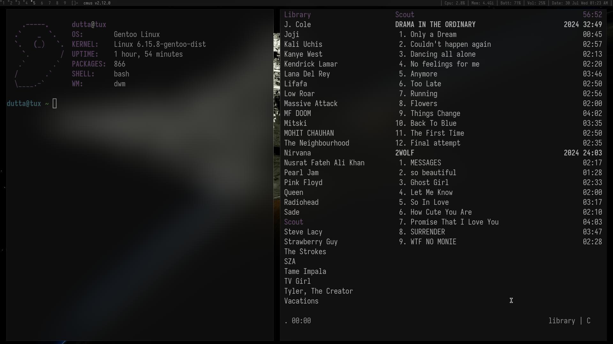

this is what i use as my daily driver :)
welp update/use as you like, this is configured for gentoo (btw)

added patches:
[vanitygaps](https://dwm.suckless.org/patches/vanitygaps/)
[attachaside](https://dwm.suckless.org/patches/attachaside/)

here's what it looks like?

